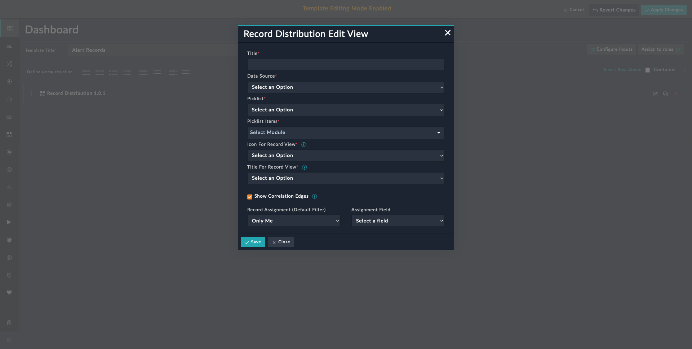
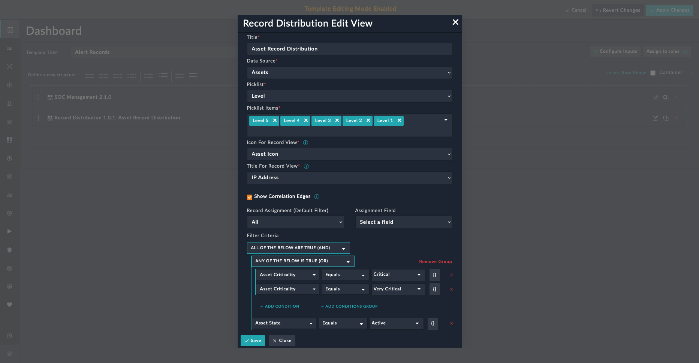
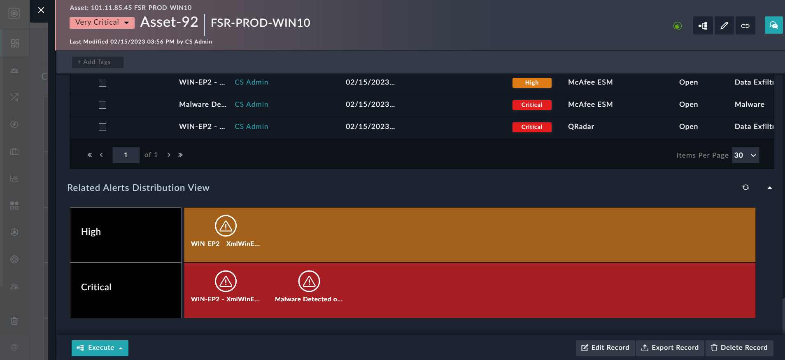

| [Home](../README.md) |
| -------------------- |

# Usage

The **Record Distribution** widget helps visualise records or items based on a specified grouping criterion. For example, viewing the distribution of assets by purdue levels, or the distribution of alerts by type, severity, or other criteria.

You can group records using a picklist, say *Levels* in the **Assets** module. With such a criterion you can view all of the assets together and at each level. Additionally, it also provides a visual depiction of each record node in the group.

You can add this view to a dashboard, report, or within the detailed view of a module's record.

## Features

- Visualize items or records based on specified grouping criteria.

- Configure the widget by selecting module-wise picklists and setting filters to retrieve the required data.

    <table>
        <td><strong>NOTE</strong></td><td>Up to 100 records are fetched for detailed rendering.</td>
    </table>

- Add visual lines to identify correlations between grouped records from the same module at different levels.

## Record Distribution Widget

<table>
    <td><strong>NOTE</strong></td><td>Refer to the section <a href="./setup.md#setting-up-modules-to-use-icons-for-records">Setting up Modules to use Icons for Records</a> in <em>Configuration</em> instructions before integrating the widget in your workflows.</td>
</table>

1. Edit a *Dashboard*, *Report*, or a module record's view template and select **Add Widget** button.

2. Select **Record Distribution** from the list to bring up the **Record Distribution** widget's customization modal.

3. Specify the title of the visual depiction of each record node in the group in the **Title** field.

    

4. Select the module, whose records are to be grouped, in the **Select Data Source** field.

5. Select the picklist using which to group the records, in the **Picklist** field.

6. Select values to be displayed in the previously selected picklist, in the **Picklist Items** field.

7. Select the lookup field associated with the record icon, in the **Icon for Record View** field.

8. Specify a title that appears under each icon in the **Title for Record View** field. You can configure the title widget to display values such as the *Name* or *IP address*.

9. Select **Show Correlation Edges** to add visual lines on the view to depict correlations between records grouped at various levels.

10. Select **Only Me** in **Record Assignment (Default Filter)** to display only those records that are assigned to the logged-in user.

    Select **All** to display all records based on the defined filters.

11. Select the **Assignment Field** based on which records are assigned for the selected module.

12. Define the filter criteria using which to filter the data retrieved by this widget.

    <table>
        <td><strong>NOTE</strong></td><td>A maximum of 100 records are fetched for rendering details.</td>
    </table>
    
    For example, filters can be applied for tasks like displaying the widget with only those asset records that meet the following criteria:

    - Related ICS Advisory records are present
    - IDs are not `null`
    - State is *Active*
    - Criticality is *Very Critical* or *Critical*

    Following image displays a pre-selected filter criteria:
    
    

### Record Distribution Widget - Dashboard View

The following image displays a **Record Distribution** widget based on an example where you might want to view assets grouped by their levels in a Dashboard. It also shows visual lines that display the correlations between asset records grouped at various levels:

In above example, clicking **View All Records** displays a list of all asset records at *Level 5*.

<table>
    <td><strong>TIP</strong></td><td>We recommend defining the filter criteria that restricts the displayed records within the maximum limit of 100 records.</td>
</table>

### Record Distribution Widget - Module Detail View

The following image displays a **Record Distribution** widget based on an example where you might want to view alerts (linked to the asset records) grouped by their *Severity* in the detailed view of an asset record:

<table>
    <td><strong>NOTE</strong></td><td>If the asset record does not have any linked alerts, then the <strong>Record Distribution</strong> widget displays the following message:  
    <strong>No records found!</strong></td>
</table>

| [Installation](./setup.md#installation) | [Configuration](./setup.md#configuration) |
| --------------------------------------- | ----------------------------------------- |